# Lab Report 1
For this lab you will be learning how to setup your CSE15L account for the first time. If needed, you will also be installing Visual Studio Code. These two things will be necessary to practice connecting to a remote server for the very first time!(in this class atleast)

## Setting Up Account for Lab
The first thing to do is to find your specific course account. You can do that here:

[Find Account](https://sdacs.ucsd.edu/~icc/index.php)

1. Log in with your UCSD credentials.
2. Choose your account(make sure to choose the cs15l account as there is a possibility that you have multiple accounts).
3. Follow the on screen instructions to reset your password.

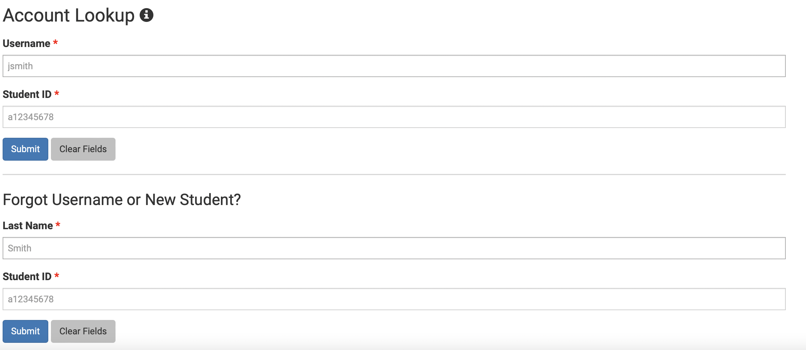

**Personal Experience**
* For me logging in to the website provided was very smooth because I just used my UCSD credentials(as prompted) to log in.
* However when it came to changing my password I had to reset it twice because I forgot it when I was connnecting to the remote server(I'll talk about this later on)

## Installing Visual Studio Code
You will now need something to be able to access a terminal and connect to a remote server. Thus, we will be installing Visual Studio Code. If you don't want to install VScode for whatever reason(I suggest you do) then you can just access it on the CS lab computers.
You can Install Visual Studio code here:

[Visual Studio Code Download](https://code.visualstudio.com/download)

Make sure that you install the correct version depending on your device

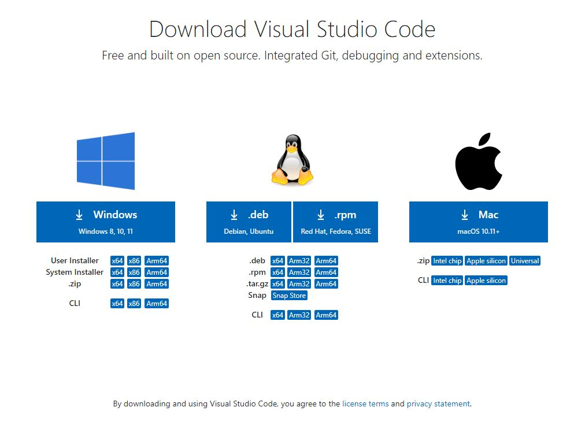

After you click download that is specific for your device, you want to follow the on screen instructions. When it is installed you should be able to open a program that looks like the following:

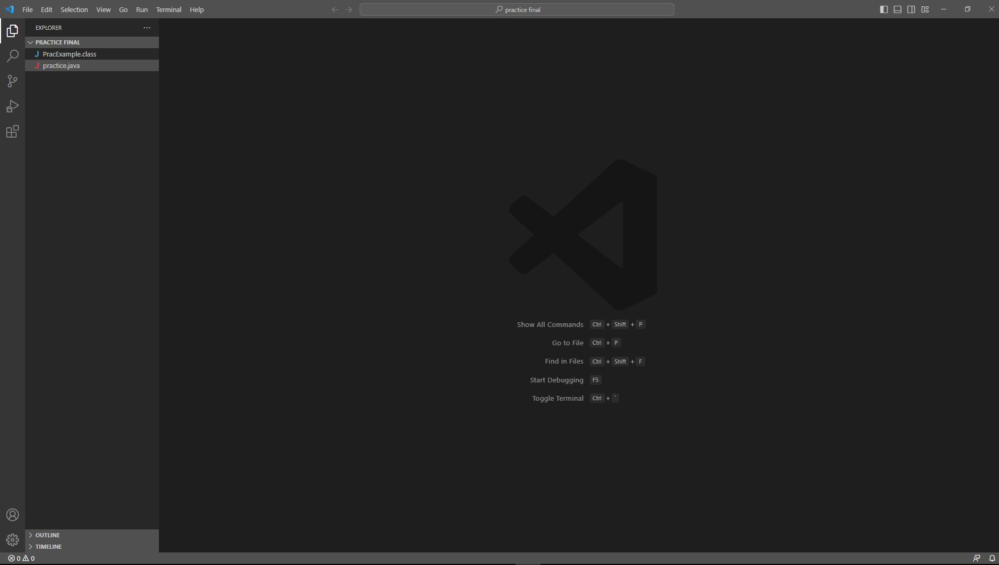

Congratulations! You now have Visual Studio Code installed on your device and don't have to rely on the lab computers. 

**Personal Experience**
* I personally did not have to do this step as I already had VScode installed due to prior CS courses that I took(might be the case for a lot of people).
* One important thing to remember is to make sure to download the version of Visual Studio Code that is meant for your specific device.

## Establishing Remote Access
You have now obtained and installed the necessary tools and information to be able to remotely connect to a server. In this case we will be connecting to the lab computers. We will be using our cs15l accounts to connect to a computer over the internet, could be a remote server. In order to do this we will also be using a terminal within VScode.

However, Windows users you need to take an extra step. If you are on MAC(superior system) you can skip this step. You will need to download **GIT**.
You can download it here:

[Git download](https://gitforwindows.org/)

You will also need to change the terminal in Visual Studio Code to change your terminal to use git that we just installed. Instructions here:

[How to Change Terminal](https://stackoverflow.com/a/50527994)

We will now be able to use `ssh` which will allow us to actually connect to a remote server. You want to first open up a terminal in VScode by going to the menu and selecting **terminal** then **new terminal**. We can now enter a command line with ``ssh`` that will let us connect to a remote server. It will look like this:

``ssh cs15lsp23XX@ieng6.ucsd.edu``

**Note**: The "XX" in the command should be replaced with the letters that are in your cs15l account. This is just a generic representation of how it should look.

The terminal should then prompt you to enter a password(this password is the one that you just reset earlier on in this lab). Make sure to enter it correctly or it won't let you into the server. 
* **Note**: When you go to type your password, the terminal will not display any of the keys that you press, but it is typing.

Once you type in your password correctly and login the terminal will prompt you with a long text that is asking you to confirm authenticity of the connection to the server or something along those lines. Since it is your first time connecting to the server it will make sure that it is secure to connect your account to it. You want to say **Yes** to this message so that it allows you connect to the server. After you say yes to the prompt your terminal should have a bunch of information like this:

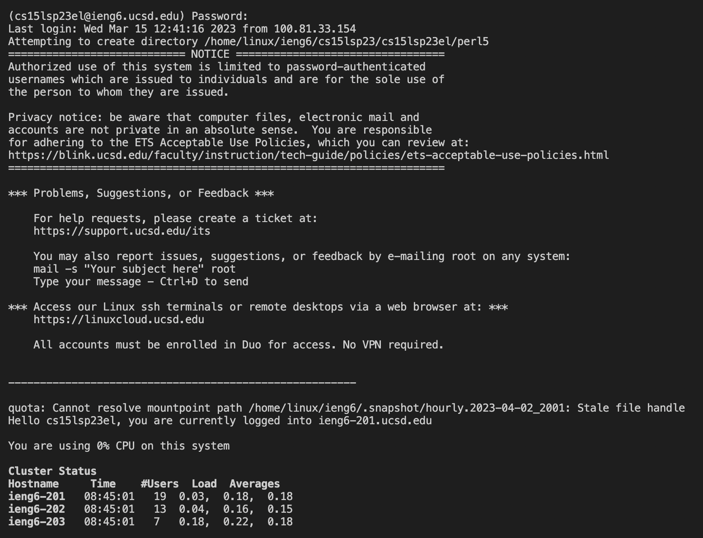

You have now remotely connected to the server! In the next step you will learn some commands to type in to the terminal to interact with the server. Make sure to ask questions if necessary and document what you are doing.

**Personal Experience**
* I did not have to do the step that involved installing **Git** and changing the terminal within VScode as I am on MAC and it didn't require me to do it.
* I had trouble with the passsword portion of this step because I was confused as to why nothing was showing up in the terminal when I typed. I had to get this cleared up with a tutor.
* I also had trouble with the password portion because I kept getting it wrong and had to go back in the lab steps and reset my password once again.
* Other than that I was able to successfully connect to the server.

## Running Commands in the Terminal After Successful Remote Connection
We will now run some commands in the terminal that will run on the server that we conected to. We will be able to access the information that is stored in the server. We will use this to practice our commands.

You can now some of the commands that we learned in lecture like ``cd``, ``ls``, ``pwd``, ``cp``, and ``cat``.

Here are some commands that you can run:
* ``cd``
* ``ls -lat`` (this should bring up a lot of information like you see in the picture below)
* ``cp /home/linux/ieng6/cs15lsp23/public/hello.txt ~/``
* ``ls -a`` (once again this should bring up some information)
* ``pwd`` (should print your current working directory)
* ``cp /home/linux/ieng6/cs15lsp23/public/hello.txt ~/``

Make sure to document your activities in the terminal. After running some commands your terminal should look a little bit like this:

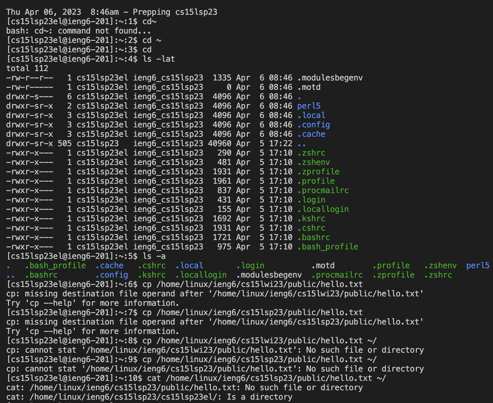

**Personal Experience**
* I had some issues typing in some of the commands that were given to us because I was typing in "wi" for winter like on the lab instructions but we were supposed to be typing in "sp" for spring. Due to this it kept giving me errors.
* Another thing I had trouble with was making sure I was including spaces between the commands in order to make sure the terminal knows they are separate.

## Using git, Github, and GitHub Pages
These three things are extremely useful tools to know. Github is a website that allows you to store and share code and information on a website. Within Github there is GitHub pages that allows you to create a sort of website for yourself. These two things use a tool called git.

* [Github site](https://github.com)
* Within this site you should be able to access GitHub Pages and learn about git as well.

**Personal Experience**
* For this part I didn't necessarily have any trouble understanding what to do.
* I have prior knowledge as to what GitHub was and how it works, but this was my first time using it.

## Now We Will Create a Website with GitHub Pages
In order to first start the process of making our website we will need to make an account. If you already have an account then you can just use that.
You can start making your account here:

[Github.com](https://github.com)
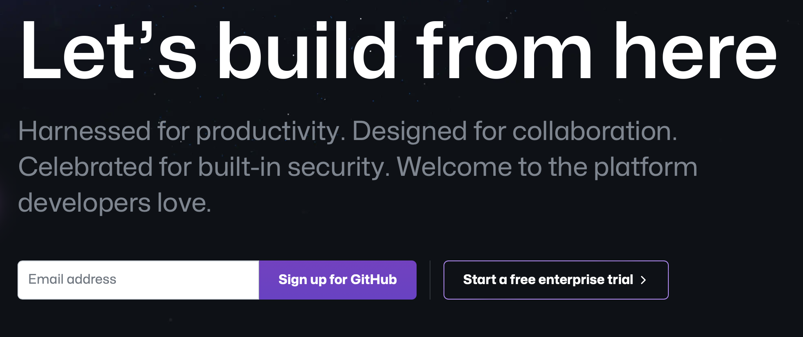

### Creating Repository to Start Storing Code
After you have followed the onscreen instructions and created your account you should be able to access GitHub and start storing and sharing your code.

In order to begin doing this, you have to create a repository. To do this you want to go to the top right corner and hit the ``+`` -> ``New Repository``.
This repository will allow you to store and share your code. It is very similar to a file that you would elsewhere like Google Drive. After you click new repository you should get a screen like this:

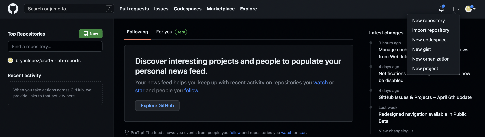

In the name you want to name the repository something that is related to what is going to be stored in it. In this case let's name it ``cs15l-lab-reports``.

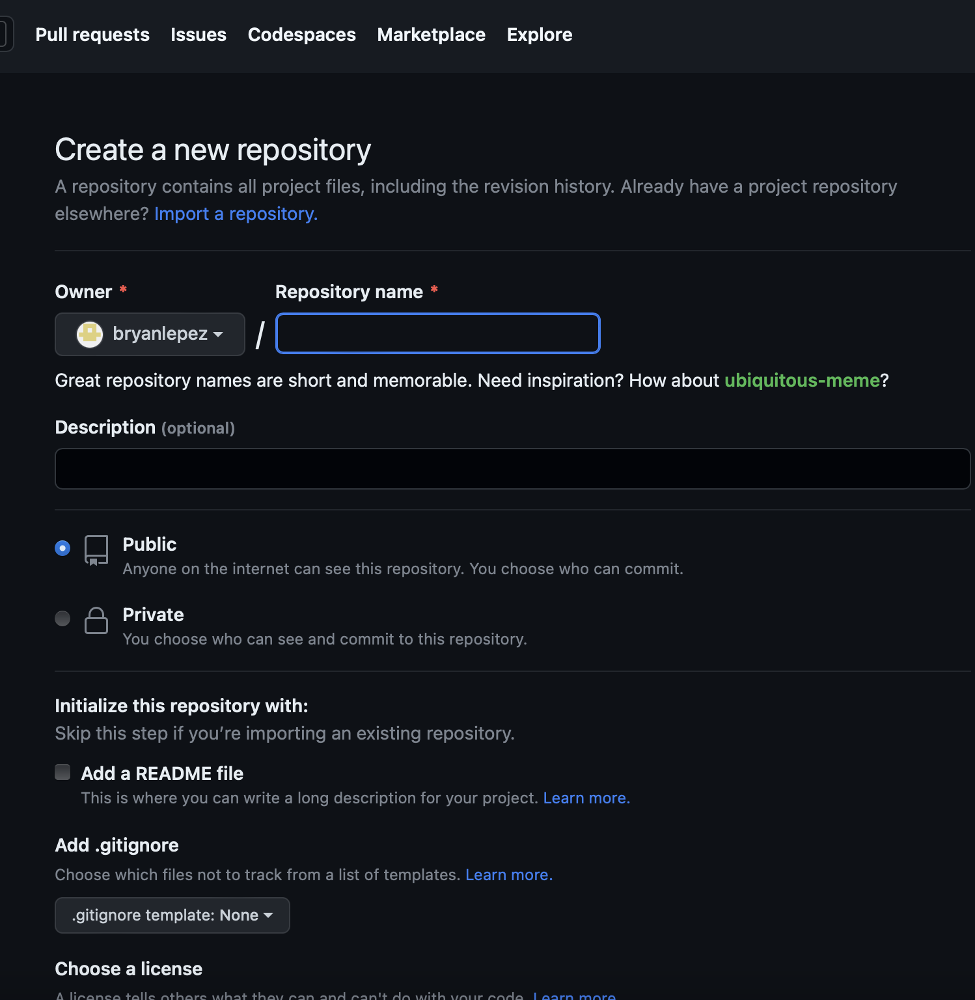

You should now see the main menu of your repository which looks like this:

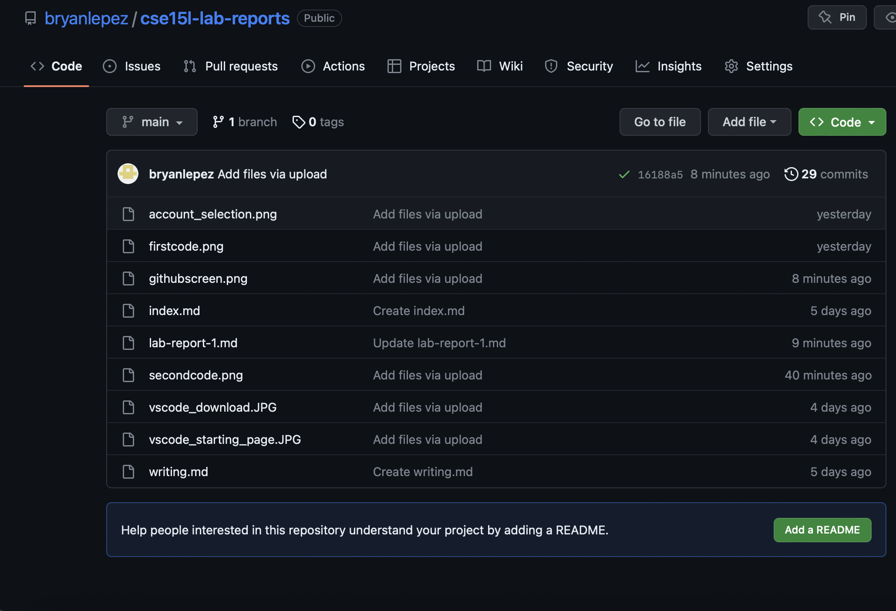

On your screen, if it's your first time using GitHub, you should see a little "Create new File" button in blue letters towards the top of your repository. Click that and it will prompt you to select a name for the file. Make the name of the file ``index.md``. You can put anything you want into this file!
Once you put something in the file you can scroll down and select "Commit new File". This will give you a link that you can now share.

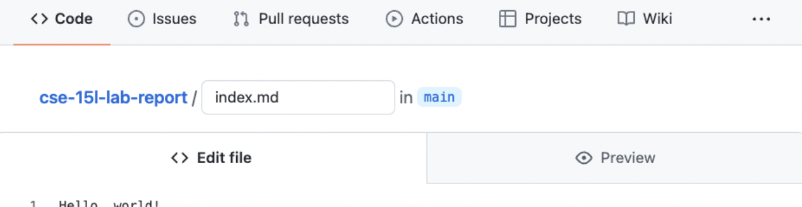

**Personal Experience**
* For this part I didn't have any problems at all, I just followed the instructions and everything worked perfectly fine.
* This was my first time using GitHub so I had to do everything that was required in this step.

### Now We Can Start Making a Website with Pages
Now we can make a website using GitHub. In order to do this we have to first go to settings in our GitHub Repository and click "Pages" which should be on the left handside of the settings.

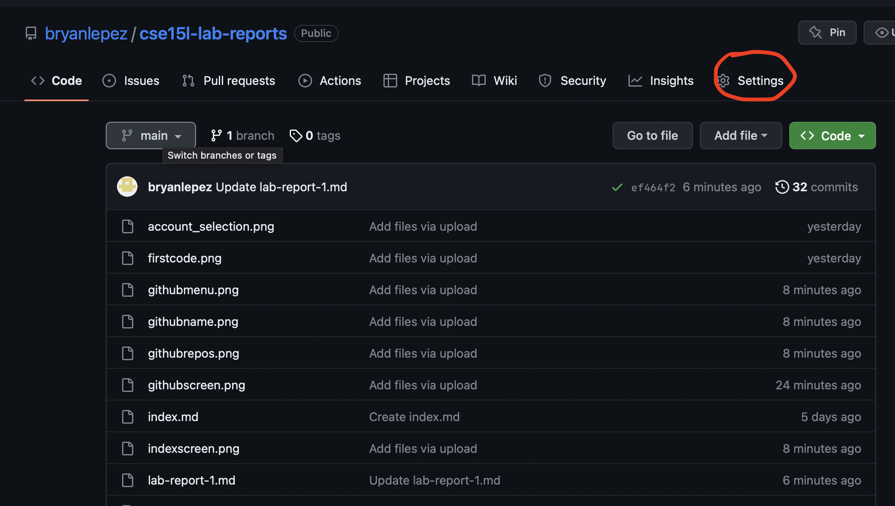

When you are on pages you want to set your branch to main like in the picture below:

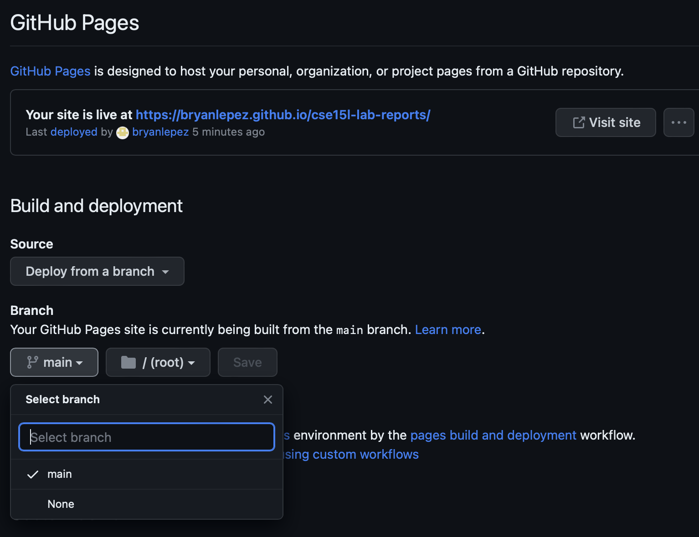

After you set the branch to main it should save. Soon it will give you a link towards the top of the pages screen that you can click to send you to your new website!! Now add a new file, name it whatever you want but make sure to add the extensiong ``.md``.
You can access different files within your repository with this link by adding the file name + ``.html`` at the end. This is the case for .md files that we will be using. Your new site will looke something similar to this:

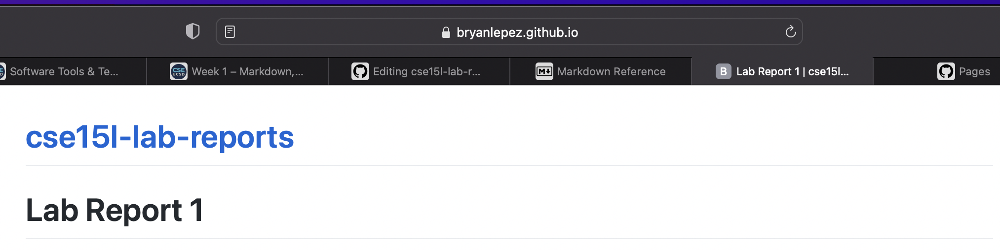

**Personal Experience**
* For the most part these steps were very basic and I was able to follow them directly so that everything worked fine.
* A slight issue, not very much an issue, was that my link took a long time to pop up when I initially created my Pages.

### What is Markdown and How do We Use it
Markdown is a way of writing and formatting that GitHub uses within Pages to allow us to create our websites. Markdown is denoted by ``.md``. This extension allows us to use MarkDown which allows us to format and put words on our screens in an easier manner. You can find more information on the different techniques within markdown and what it is here:

1. [Techniques within Markdown](https://commonmark.org/help/)
2. [What is it?](https://www.markdownguide.org/getting-started/)

After reading this two pieces of content over Markdown you should now know some basic techniques within Markdown. In the extra file that you created you should practice using some of these Markdown techniques.

Now we have one more checklist:
1. You must have two files "index.md" and whatever other .md file you created.
2. You should have practiced Markdown within one of these files.
3. Able to make the changes in your .md files appear on your Pages at the URL provided to you.

Congrats! You have now made a simple website for yourself!

**Personal Experience**
* These steps were once again very easy to follow and I didn't have any problems with this portion of the lab at all.
* One thing that I need more practice with is using and learning Markdown to be able to make better sites.

  
